# Flow Diagrams

This document contains all architecture and flow diagrams for the Live Scoreboard API Service Module. These diagrams are written in Mermaid syntax and can be rendered directly on GitHub or using the [Mermaid Live Editor](https://mermaid.live).

---

## Table of Contents

1. [System Architecture](#1-system-architecture)
2. [Score Update Flow](#2-score-update-flow-complete-sequence)
3. [Security Validation Pipeline](#3-security-validation-pipeline)
4. [SSE Connection Lifecycle](#4-sse-connection-lifecycle)
5. [Redis Data Flow](#5-redis-data-flow)
6. [Action Token Flow](#6-action-token-flow)
7. [Rate Limiting Flow](#7-rate-limiting-sliding-window)
8. [Error Handling Flow](#8-error-handling-flow)

---

## 1. System Architecture

High-level overview of all system components and their interactions.

```mermaid
flowchart TB
    subgraph Clients["🌐 Client Layer"]
        direction LR
        C1["Browser A<br/>(REST + SSE)"]
        C2["Browser B<br/>(REST + SSE)"]
        C3["Browser N<br/>(REST + SSE)"]
    end

    subgraph Gateway["⚡ API Gateway / Load Balancer"]
        LB["Nginx / AWS ALB<br/>• TLS Termination<br/>• DDoS Protection<br/>• Request Routing"]
    end

    subgraph AppCluster["🖥️ Application Server Cluster"]
        subgraph Server1["Server Instance 1"]
            S1_API["REST API"]
            S1_SSE["SSE Handler"]
        end
        subgraph Server2["Server Instance 2"]
            S2_API["REST API"]
            S2_SSE["SSE Handler"]
        end
    end

    subgraph Services["📦 Core Services"]
        AUTH["Auth Service<br/>• JWT Validation<br/>• Token Management"]
        SCORE["Score Service<br/>• Score Calculation<br/>• Validation"]
        RANKING["Ranking Service<br/>• Redis Operations<br/>• Lua Scripts"]
        FRAUD["Anti-Fraud Service<br/>• Rate Limiting<br/>• Anomaly Detection"]
        SSE_MGR["SSE Manager<br/>• Connection Pool<br/>• Broadcasting"]
    end

    subgraph DataLayer["💾 Data Layer"]
        subgraph RedisCluster["Redis Cluster"]
            R_LEADER["Sorted Set<br/>leaderboard:global"]
            R_TOKENS["Hash<br/>action_tokens:*"]
            R_RATE["Sorted Set<br/>rate_limits:*"]
            R_PUBSUB["Pub/Sub<br/>leaderboard:events"]
        end
        
        subgraph PostgreSQL["PostgreSQL (Primary + Replica)"]
            PG_USERS["users"]
            PG_SCORES["score_updates"]
            PG_AUDIT["audit_log"]
        end
    end

    %% Client connections
    C1 & C2 & C3 -->|"HTTPS/WSS"| LB

    %% Load balancer to servers
    LB --> Server1 & Server2

    %% Server to Services
    S1_API & S2_API --> AUTH
    S1_API & S2_API --> SCORE
    S1_SSE & S2_SSE --> SSE_MGR

    %% Service dependencies
    AUTH --> R_TOKENS
    SCORE --> RANKING
    SCORE --> FRAUD
    RANKING --> R_LEADER
    FRAUD --> R_RATE
    SSE_MGR --> R_PUBSUB

    %% Persistence
    SCORE -.->|"Async"| PostgreSQL

    %% SSE broadcast
    R_PUBSUB -->|"Subscribe"| SSE_MGR
    SSE_MGR -->|"Broadcast"| S1_SSE & S2_SSE
```



---

## 2. Score Update Flow (Complete Sequence)

Detailed sequence diagram showing the entire score update process from action start to SSE broadcast.


---

## 3. Security Validation Pipeline

Flowchart showing the 5-layer security validation that every score update must pass.

```mermaid
flowchart TD
    START(["📨 POST /api/v1/scores/update"]) --> LAYER1

    subgraph LAYER1["🔐 LAYER 1: JWT Authentication"]
        L1_CHECK{"JWT<br/>Valid?"}
        L1_STEPS["• Decode token<br/>• Verify signature (RS256/HS256)<br/>• Check expiration (exp claim)<br/>• Extract user_id (sub claim)"]
    end

    subgraph LAYER2["🎫 LAYER 2: Action Token Validation"]
        L2_CHECK{"Token<br/>Valid?"}
        L2_STEPS["• Token exists in Redis<br/>• Not expired (TTL: 5 min)<br/>• Not already used<br/>• Matches requesting user_id"]
    end

    subgraph LAYER3["⏱️ LAYER 3: Rate Limiting"]
        L3_CHECK{"Within<br/>Limit?"}
        L3_STEPS["• Sliding window algorithm<br/>• 10 requests per 60 seconds<br/>• Per-user + Per-IP limits<br/>• Redis ZRANGEBYSCORE"]
    end

    subgraph LAYER4["🔢 LAYER 4: Request Integrity"]
        L4_CHECK{"Checksum<br/>Valid?"}
        L4_STEPS["• Compute HMAC-SHA256(actionData)<br/>• Compare with client checksum<br/>• Timing-safe comparison<br/>• Validate score bounds"]
    end

    subgraph LAYER5["✅ LAYER 5: Business Validation"]
        L5_CHECK{"Action<br/>Valid?"}
        L5_STEPS["• Action type exists<br/>• Score within action limits<br/>• No anomaly patterns detected<br/>• User eligible for action"]
    end

    SUCCESS(["✨ PROCESS SCORE UPDATE"])

    E401["❌ 401 UNAUTHORIZED<br/>Invalid or expired JWT"]
    E403_T["❌ 403 FORBIDDEN<br/>Invalid action token"]
    E429["❌ 429 TOO MANY REQUESTS<br/>Rate limit exceeded"]
    E403_C["❌ 403 FORBIDDEN<br/>Checksum mismatch"]
    E400["❌ 400 BAD REQUEST<br/>Invalid action"]

    LAYER1 --> L1_STEPS --> L1_CHECK
    L1_CHECK -->|"❌ No"| E401
    L1_CHECK -->|"✅ Yes"| LAYER2

    LAYER2 --> L2_STEPS --> L2_CHECK
    L2_CHECK -->|"❌ No"| E403_T
    L2_CHECK -->|"✅ Yes"| LAYER3

    LAYER3 --> L3_STEPS --> L3_CHECK
    L3_CHECK -->|"❌ No"| E429
    L3_CHECK -->|"✅ Yes"| LAYER4

    LAYER4 --> L4_STEPS --> L4_CHECK
    L4_CHECK -->|"❌ No"| E403_C
    L4_CHECK -->|"✅ Yes"| LAYER5

    LAYER5 --> L5_STEPS --> L5_CHECK
    L5_CHECK -->|"❌ No"| E400
    L5_CHECK -->|"✅ Yes"| SUCCESS

    style START fill:#4F46E5,color:#fff
    style SUCCESS fill:#10B981,color:#fff
    style E401 fill:#EF4444,color:#fff
    style E403_T fill:#EF4444,color:#fff
    style E429 fill:#F59E0B,color:#fff
    style E403_C fill:#EF4444,color:#fff
    style E400 fill:#EF4444,color:#fff
```



---

## 4. SSE Connection Lifecycle

Sequence diagram showing how SSE connections are established, maintained, and recovered.

```mermaid
sequenceDiagram
    participant Client as 🌐 Browser
    participant Server as 📡 SSE Manager
    participant Redis as 🔴 Redis

    Note over Client,Redis: ═══════════ CONNECTION ESTABLISHMENT ═══════════

    Client->>+Server: GET /api/v1/events/leaderboard<br/>Accept: text/event-stream<br/>Authorization: Bearer {jwt}

    Server->>Server: Validate JWT token
    
    Server-->>Client: HTTP 200 OK<br/>Content-Type: text/event-stream<br/>Cache-Control: no-cache<br/>Connection: keep-alive

    Server->>Server: Add to connection pool<br/>connectionPool.set(userId, response)

    Server->>+Redis: ZREVRANGE leaderboard:global 0 9 WITHSCORES
    Redis-->>-Server: Initial top 10

    Server->>Client: id: 1<br/>event: connected<br/>data: {"connectionId":"conn_abc","serverTime":"..."}

    Server->>Client: id: 2<br/>event: leaderboard_update<br/>data: {"leaderboard":[...],"timestamp":"..."}

    Server->>+Redis: SUBSCRIBE leaderboard:events
    Redis-->>-Server: Subscribed

    Note over Client,Redis: ═══════════ NORMAL OPERATION ═══════════

    loop Heartbeat (every 30 seconds)
        Server->>Client: id: N<br/>event: heartbeat<br/>data: {"timestamp":"..."}
    end

    Note over Redis: Another user's score update<br/>triggers leaderboard change

    Redis-->>Server: PUBLISH leaderboard:events<br/>{type: "update", ...}

    Server->>+Redis: ZREVRANGE leaderboard:global 0 9
    Redis-->>-Server: Updated top 10

    Server->>Client: id: N+1<br/>event: leaderboard_update<br/>data: {"leaderboard":[...],"changedRanks":[1,2]}

    Note over Client,Redis: ═══════════ CONNECTION RECOVERY ═══════════

    Note over Client,Server: ⚠️ Network interruption

    Client--xServer: Connection dropped

    Server->>Server: Detect disconnect<br/>connectionPool.delete(userId)

    Note over Client: Browser detects disconnect<br/>SSE auto-reconnects (built-in)

    Client->>+Server: GET /api/v1/events/leaderboard<br/>Last-Event-ID: N+1

    Server->>Server: Validate JWT (still valid)

    Server-->>Client: HTTP 200 OK

    Server->>Client: id: N+2<br/>event: reconnected<br/>data: {"missedEvents":0}

    Note over Client: ✅ Connection restored<br/>Resume from last event ID

    Note over Client,Redis: ═══════════ GRACEFUL DISCONNECT ═══════════

    Client->>Server: Close connection (page unload)
    
    Server->>Server: Cleanup<br/>connectionPool.delete(userId)
    
    Server->>Redis: UNSUBSCRIBE leaderboard:events<br/>(if no more connections)
```



---

## 5. Redis Data Flow

Diagram showing how data flows through Redis data structures.

```mermaid
flowchart LR
    subgraph Input["📥 Input Operations"]
        SCORE_UPDATE["Score Update<br/>Request"]
        ACTION_START["Action Start<br/>Request"]
        API_REQUEST["Any API<br/>Request"]
    end

    subgraph Redis["🔴 Redis Data Structures"]
        subgraph SortedSets["Sorted Sets"]
            LEADERBOARD["leaderboard:global<br/>─────────────<br/>user_456: 15420<br/>user_789: 14200<br/>user_123: 1250<br/>..."]
            RATE_LIMIT["rate_limit:user:123<br/>─────────────<br/>req_1: 1705312200<br/>req_2: 1705312215<br/>req_3: 1705312230"]
        end

        subgraph Hashes["Hashes"]
            ACTION_TOKEN["action_token:tok_xyz<br/>─────────────<br/>userId: user_123<br/>actionId: act_abc<br/>maxScore: 500<br/>used: false"]
            USER_CACHE["user:user_123<br/>─────────────<br/>username: PlayerOne<br/>avatarUrl: https://...<br/>lastUpdate: 1705312200"]
        end

        subgraph PubSub["Pub/Sub"]
            EVENTS["leaderboard:events<br/>─────────────<br/>Channel for<br/>broadcasting updates"]
        end
    end

    subgraph Output["📤 Output Operations"]
        TOP_10["GET Top 10<br/>Leaderboard"]
        VALIDATE["Validate<br/>Action Token"]
        BROADCAST["SSE<br/>Broadcast"]
    end

    %% Input flows
    SCORE_UPDATE -->|"ZADD"| LEADERBOARD
    SCORE_UPDATE -->|"HSET used=true"| ACTION_TOKEN
    SCORE_UPDATE -->|"PUBLISH"| EVENTS
    
    ACTION_START -->|"HSET + EXPIRE"| ACTION_TOKEN
    
    API_REQUEST -->|"ZADD timestamp"| RATE_LIMIT

    %% Output flows
    LEADERBOARD -->|"ZREVRANGE 0 9"| TOP_10
    LEADERBOARD -->|"ZREVRANK"| TOP_10
    
    ACTION_TOKEN -->|"HGETALL"| VALIDATE
    
    RATE_LIMIT -->|"ZRANGEBYSCORE"| VALIDATE
    
    EVENTS -->|"SUBSCRIBE"| BROADCAST

    style LEADERBOARD fill:#FEF3C7,stroke:#F59E0B
    style RATE_LIMIT fill:#FEF3C7,stroke:#F59E0B
    style ACTION_TOKEN fill:#DBEAFE,stroke:#3B82F6
    style USER_CACHE fill:#DBEAFE,stroke:#3B82F6
    style EVENTS fill:#F3E8FF,stroke:#8B5CF6
```



---

## 6. Action Token Flow

Detailed flow of how action tokens prevent replay attacks and unauthorized score updates.

```mermaid
sequenceDiagram
    participant Client as 🌐 Client
    participant Server as 🖥️ Server
    participant Redis as 🔴 Redis

    Note over Client,Redis: ═══════════ TOKEN GENERATION ═══════════

    Client->>+Server: POST /api/v1/actions/start<br/>{actionType: "level_complete"}

    Server->>Server: Generate unique token<br/>tokenId = UUID()

    Server->>Server: Create token payload<br/>{userId, actionType, maxScore, issuedAt, expiresAt}

    Server->>+Redis: HSET action_token:tok_xyz<br/>userId "user_123"<br/>actionId "act_abc"<br/>actionType "level_complete"<br/>maxScore "500"<br/>used "false"<br/>issuedAt "1705312200"
    Redis-->>-Server: OK

    Server->>+Redis: EXPIRE action_token:tok_xyz 300
    Redis-->>-Server: OK (5 min TTL)

    Server-->>-Client: {actionToken: "tok_xyz", expiresIn: 300}

    Note over Client,Redis: ═══════════ TOKEN VALIDATION (Success) ═══════════

    Client->>+Server: POST /api/v1/scores/update<br/>X-Action-Token: tok_xyz

    Server->>+Redis: HGETALL action_token:tok_xyz
    Redis-->>-Server: {userId: "user_123", used: "false", ...}

    Server->>Server: Validate:<br/>✅ Token exists<br/>✅ userId matches<br/>✅ Not used<br/>✅ Not expired

    Server->>+Redis: HSET action_token:tok_xyz used "true"
    Redis-->>-Server: OK (marked as used)

    Server->>Server: Process score update...

    Server-->>-Client: {newScore: 1250, ...}

    Note over Client,Redis: ═══════════ TOKEN REPLAY ATTACK (Blocked) ═══════════

    Client->>+Server: POST /api/v1/scores/update<br/>X-Action-Token: tok_xyz (reused!)

    Server->>+Redis: HGETALL action_token:tok_xyz
    Redis-->>-Server: {userId: "user_123", used: "true", ...}

    Server->>Server: Validate:<br/>✅ Token exists<br/>✅ userId matches<br/>❌ Already used!

    Server-->>-Client: 403 Forbidden<br/>{error: "INVALID_ACTION_TOKEN",<br/>message: "Token already used"}

    Note over Client,Redis: ═══════════ TOKEN EXPIRY (Blocked) ═══════════

    Note over Redis: After 5 minutes...<br/>Token auto-deleted by TTL

    Client->>+Server: POST /api/v1/scores/update<br/>X-Action-Token: tok_xyz

    Server->>+Redis: HGETALL action_token:tok_xyz
    Redis-->>-Server: (nil) - Token not found

    Server-->>-Client: 403 Forbidden<br/>{error: "INVALID_ACTION_TOKEN",<br/>message: "Token expired or invalid"}
```



---

## 7. Rate Limiting (Sliding Window)

Flow diagram showing the sliding window rate limiting algorithm using Redis sorted sets.

```mermaid
flowchart TD
    subgraph Request["📨 Incoming Request"]
        REQ["User: user_123<br/>Time: 10:30:45"]
    end

    subgraph Algorithm["⏱️ Sliding Window Algorithm"]
        STEP1["1️⃣ Calculate window boundaries<br/>window_start = now - 60s<br/>window_end = now"]
        
        STEP2["2️⃣ Remove expired entries<br/>ZREMRANGEBYSCORE key 0 window_start"]
        
        STEP3["3️⃣ Count current requests<br/>ZCARD key"]
        
        STEP4{"4️⃣ Check limit<br/>count < 10?"}
        
        STEP5A["5️⃣a Add request<br/>ZADD key now request_id"]
        
        STEP5B["5️⃣b Reject request"]
        
        STEP6["6️⃣ Set TTL<br/>EXPIRE key 60"]
    end

    subgraph Redis["🔴 Redis Sorted Set"]
        BEFORE["BEFORE cleanup:<br/>─────────────<br/>rate_limit:user:123<br/>├─ req_1: 10:29:30 ⚠️ expired<br/>├─ req_2: 10:29:50 ⚠️ expired<br/>├─ req_3: 10:30:10<br/>├─ req_4: 10:30:20<br/>├─ req_5: 10:30:30<br/>└─ req_6: 10:30:40"]
        
        AFTER["AFTER cleanup:<br/>─────────────<br/>rate_limit:user:123<br/>├─ req_3: 10:30:10<br/>├─ req_4: 10:30:20<br/>├─ req_5: 10:30:30<br/>├─ req_6: 10:30:40<br/>└─ req_7: 10:30:45 ✨ new"]
    end

    subgraph Result["📤 Result"]
        ALLOW["✅ 200 OK<br/>Request processed<br/>Remaining: 5/10"]
        DENY["❌ 429 Too Many Requests<br/>Retry-After: 25s"]
    end

    REQ --> STEP1
    STEP1 --> STEP2
    STEP2 --> BEFORE
    BEFORE -.->|"Remove expired"| AFTER
    STEP2 --> STEP3
    STEP3 --> STEP4
    
    STEP4 -->|"✅ Yes (count=4)"| STEP5A
    STEP4 -->|"❌ No (count≥10)"| STEP5B
    
    STEP5A --> STEP6
    STEP5A --> AFTER
    STEP6 --> ALLOW
    
    STEP5B --> DENY

    style ALLOW fill:#10B981,color:#fff
    style DENY fill:#EF4444,color:#fff
```



---

## 8. Error Handling Flow

Diagram showing how errors are handled and propagated through the system.

```mermaid
flowchart TD
    subgraph Errors["⚠️ Error Sources"]
        E_AUTH["Auth Error<br/>Invalid JWT"]
        E_TOKEN["Token Error<br/>Invalid/Expired"]
        E_RATE["Rate Limit<br/>Exceeded"]
        E_REDIS["Redis Error<br/>Connection Failed"]
        E_DB["Database Error<br/>Write Failed"]
        E_VALIDATION["Validation Error<br/>Invalid Data"]
    end

    subgraph Handler["🛡️ Error Handler"]
        CLASSIFY{"Classify<br/>Error Type"}
        
        CLIENT_ERR["Client Error<br/>(4xx)"]
        SERVER_ERR["Server Error<br/>(5xx)"]
        
        LOG["Log Error<br/>• Request ID<br/>• Stack trace<br/>• Context"]
        
        METRICS["Update Metrics<br/>• Error count<br/>• Error rate<br/>• By type"]
    end

    subgraph Response["📤 Error Response"]
        R400["400 Bad Request<br/>{code: 'INVALID_REQUEST'}"]
        R401["401 Unauthorized<br/>{code: 'UNAUTHORIZED'}"]
        R403["403 Forbidden<br/>{code: 'FORBIDDEN'}"]
        R429["429 Too Many Requests<br/>{code: 'RATE_LIMITED',<br/>retryAfter: 45}"]
        R500["500 Internal Error<br/>{code: 'INTERNAL_ERROR',<br/>requestId: 'xxx'}"]
        R503["503 Service Unavailable<br/>{code: 'SERVICE_UNAVAILABLE',<br/>retryAfter: 30}"]
    end

    subgraph Recovery["🔄 Recovery Actions"]
        RETRY["Retry with<br/>Exponential Backoff"]
        FALLBACK["Use Fallback<br/>(Stale Cache)"]
        CIRCUIT["Open Circuit<br/>Breaker"]
        ALERT["Send Alert<br/>to On-Call"]
    end

    E_AUTH --> CLASSIFY
    E_TOKEN --> CLASSIFY
    E_RATE --> CLASSIFY
    E_VALIDATION --> CLASSIFY
    E_REDIS --> CLASSIFY
    E_DB --> CLASSIFY

    CLASSIFY -->|"Auth/Validation"| CLIENT_ERR
    CLASSIFY -->|"Infrastructure"| SERVER_ERR

    CLIENT_ERR --> LOG
    SERVER_ERR --> LOG
    LOG --> METRICS

    CLIENT_ERR --> R400
    E_AUTH --> R401
    E_TOKEN --> R403
    E_RATE --> R429

    SERVER_ERR --> R500
    E_REDIS --> R503

    R500 --> RETRY
    R503 --> FALLBACK
    
    SERVER_ERR -->|"Threshold exceeded"| CIRCUIT
    CIRCUIT --> ALERT

    style R400 fill:#FBBF24,color:#000
    style R401 fill:#EF4444,color:#fff
    style R403 fill:#EF4444,color:#fff
    style R429 fill:#F59E0B,color:#fff
    style R500 fill:#7C3AED,color:#fff
    style R503 fill:#7C3AED,color:#fff
```



---

## How to View These Diagrams

### Option 1: GitHub (Recommended)
Simply push this file to GitHub - it renders Mermaid diagrams automatically.

### Option 2: Mermaid Live Editor
1. Go to [mermaid.live](https://mermaid.live)
2. Copy any diagram code block (without the \`\`\`mermaid wrapper)
3. Paste into the editor

### Option 3: VS Code
Install the "Markdown Preview Mermaid Support" extension.

### Option 4: Local HTML
Create an HTML file with:
```html
<script src="https://cdn.jsdelivr.net/npm/mermaid/dist/mermaid.min.js"></script>
<script>mermaid.initialize({startOnLoad:true});</script>
```

---

## Diagram Legend

| Symbol | Meaning |
|--------|---------|
| 🌐 | Client/Browser |
| ⚡ | Gateway/Load Balancer |
| 🔐 | Authentication |
| 📊 | Score Service |
| 🔴 | Redis |
| 🐘 | PostgreSQL |
| 📡 | SSE Manager |
| ✅ | Success |
| ❌ | Error/Failure |
| ⚠️ | Warning/Expired |
